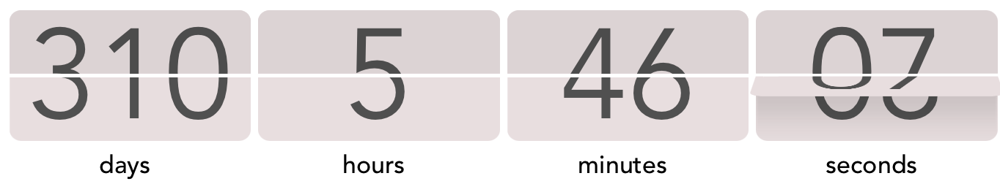

# Countdown Flipping Clock Vue 3

A Vue.js 3 component to create a CSS based countdown clock with flipping effect. 



Working demo [here](https://codesandbox.io/s/flipping-clock-8zxrcm)

## How to install

Copy the `countdown-flipping-clock` [folder](./src/components) to your `components` project folder and import it into your page.

```html
<template>
  <Countdown
    class="clock"
    targetDate="2023-11-20 17:53"
    bgColor="#EADDDF"
    fontColor="#505050"
    :shadowOpacity="0.15"
    :aspectRatio="4"
    fontSize="200px"
    :labels="{
      days: 'days',
      hours: 'hours',
      minutes: 'minutes',
      seconds: 'seconds',
    }"
  />
</template>

<script>
import Countdown from "../components/countdown-flipping-clock/clock.vue";

export default {
  name: "example",
  components: { Countdown },
};
</script>

<style scoped>
.clock {
  font-family: Avenir, Helvetica, Arial, sans-serif;
}
</style>
```

## Usage

The component has a number of customizations as parameters, as shown below:

| parameter | type | default | description |
|-|-|-|-|
| targetDate | string | required | Set the future target date for the countdown. Format YYYY-MM-DD hh:mm | 
| bgColor | string | black | Set background Color |
| fontColor | string | white | Set font color |
| shadowOpacity | integer | 0.5 | Set the opacity for the shadow casting when flipping |
| aspectRatio | integer | 4 | Set the aspect ratio for each flipping element. Must be adjusted manually for large days numbers to prevent overflow | 
| fontSize | string | 150px | Set the overall clock size in pixels. | 
| labels | object | `{days: 'days', hours: 'hours', minutes: 'minutes', seconds: 'seconds' }`| Set the labels for each individual flipping element. It can be empty to hide the element | 

Other CSS styling can be applied with a class or id set on the component. The example below specifies the font family to be displayed.

```html
<style scoped>
.clock {
  font-family: Avenir, Helvetica, Arial, sans-serif;
}
</style>
```

## License

See the [LICENSE](./LICENSE) file.
